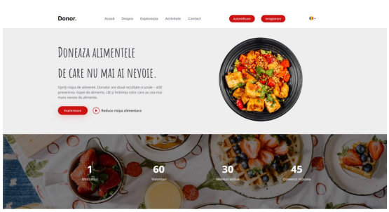

# Reduce Food Waste - Donor

## Brief description
The idea behind this project stemmed from the observation that a significant quantity of purchased food products ends up being discarded right from one's own household, without a readily available method for reusing them for charitable purposes or even for saving or recovering a certain amount of money.

The objective of this project is to create a simple and user-friendly application that stores information about food products in a suitable condition for donation or optional purchase at a greatly reduced price, and then redistributes them to organizations, food banks, or individuals in need, following a sustainable approach.

Donor takes into account several stakeholders who can benefit from the functionalities provided: users, businesses, and volunteers
## Installation
Start the backend server. Then, launch the frontend using the `npm start` command.
## Database schema

## Usage

Multilingual component  

Homepage includes statistics about activity within the application and various information.

Exploration of the menu with options for checking details and making reservations. Products with expiration dates that have passed the current date become inactive and disappear from the interface. Navigation is done by category or other filters.

User registration also includes an extension to allow users to sign up as volunteers. All fields are mandatory, and there are validations for the phone number and email format, as well as their existence. The registration window for businesses uses an API to pre-fill fields based on the entered CIF.

1. User page  
Listing an item. Validation does not allow listing an item after its expiration date has passed. Submitting the form is not allowed if the donor does not ensure quality and hygiene. The form allows the insertion of a title, a description, a product's condition, along with an image, quantity, measurement unit, and other details.  

Updating personal information or setting preferred pickup addresses.

The listed items of a donor, with options for activation/deactivation or modifying an item.

User reservations with the option to check item details and cancel a reservation

2. Volunteer page  
The page displaying the catalog of products provided by businesses for volunteers.

Once volunteers send their request, business users approve or reject it. Volunteers receive the status of the request through the 'My Requests' window, where they can schedule a pickup time for the requested package.

3. Business page  
The section for item requests from volunteers, accessible to business users. They have the option to view a list of received requests, including details of the volunteer and the requested items. For each request, businesses can choose to accept or reject them.
